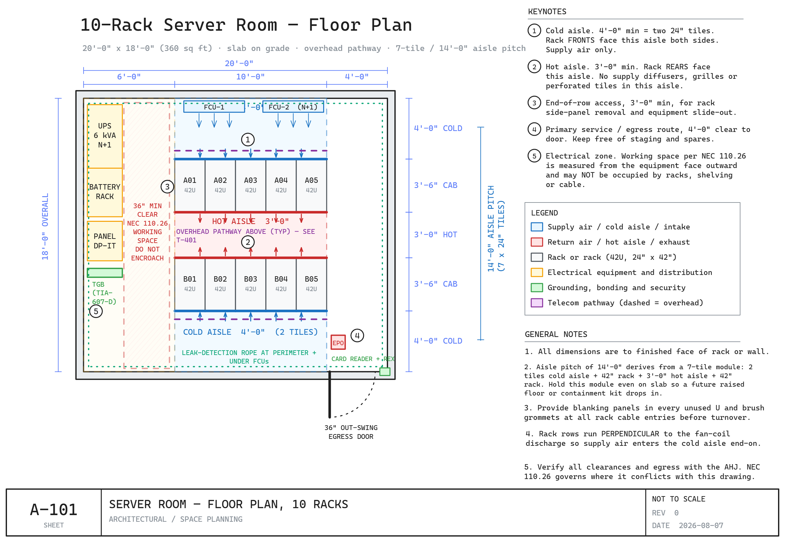

# Server Room Drawings — 20 Racks or Fewer

Fifteen editable drawing sheets for designing a small server room: layout, airflow, power,
grounding, fire protection and cabling. Every sheet is an `.excalidraw` file — open it, drag
things around, change the numbers to match your room.

Written because nearly all published data center guidance targets facilities of hundreds or
thousands of racks, where the economics and the right answers are different. These are drawn
for the 10-rack room, with a 20-rack and a narrow single-row variant alongside it.

## The drawing set

Sheets are numbered by discipline, the way a construction drawing set is: **A** architectural,
**M** mechanical, **E** electrical, **FP** fire protection, **T** telecom.

| Sheet | Title | Shows |
|-------|-------|-------|
| `A-101` | 10-Rack Server Room — Floor Plan | 20′×18′ plan, 14′ aisle pitch, NEC 110.26 working space, egress, keynotes |
| `A-102` | 20-Rack Server Room — Floor Plan | 32′×20′ plan, in-row cooling, hot-aisle containment, A/B electrical |
| `A-103` | Narrow Room — Single Row, 10 Racks | 28′×11′ plan, chimney vs. wall-plenum sections, overhead busway, comparison table |
| `A-111` | Rack Mounting Hardware, Fasteners & Load Capacity | EIA-310 hole geometry to scale, cage nut installation right and wrong, four thread types with typical torque, load ratings, bonding at the screw |
| `M-201` | Hot-Aisle / Cold-Aisle — Section | Correct airflow vs. the four classic faults, raised-floor variant |
| `M-302` | Cooling Plant, Refrigerant Routing & Condensate | Split DX through the wall to a roof condenser, line-set limits, oil traps, condensate with secondary pan and float switch, outdoor siting and the recirculation failure |
| `E-301` | Power — Single-Line Diagram | Utility → ATS → UPS → PDU → rack, EPO, maintenance bypass |
| `E-302` | Grounding & Bonding — Riser | Electrode system → TMGB → TBB → TGB → rack bonding, busbar detail |
| `E-431` | Circuit Schedule, Feed Path & Connector Plate | Phase-balanced 42-space schedule, balance under A/B failover, one branch circuit end to end, connector capacities |
| `E-450` | Lighting & Egress Illumination | Reflected ceiling plan with the fixture rows on the aisle centerlines, why an over-the-rack fixture leaves the face in shadow, illuminance targets in both planes, and the EPO boundary that egress lighting must sit outside of |
| `FP-501` | Fire Protection, Room Integrity & Life Safety | Agent and nozzle layout, cross-zoned detection, slab-to-deck enclosure integrity, pressure relief venting, cause-and-effect matrix |
| `T-201` | Rack Elevation — 42U Build Standard | 42U front and rear build standard, reach zone, zero-U PDUs |
| `T-401` | Cable Pathways & Ladder Rack | Tiered separation, ladder rack, fill and bend-radius values |
| `T-402` | Structured Cabling Topology, Conduit & Penetrations | Carrier → entrance facility → MDA → rack, computed conduit fill, sleeve through a rated wall, bend budget, OSP entrance |
| `T-605` | Conduit Sleeve Through a Rated Wall & Bend Budget | The sleeve detail that preserves both the fire rating and the clean-agent hold: firestop, grounding, spare conduit, drip loop, and the bend budget compared side by side |

Each sheet has a `.png` next to it if you just want to look rather than edit.

## Opening and editing

Go to [excalidraw.com](https://excalidraw.com) — free, no account needed — then either:

- Menu (top-left hamburger) → **Open** → pick the `.excalidraw` file, or
- Open the file in a text editor, copy the JSON, and paste onto the canvas with <kbd>Ctrl</kbd>+<kbd>V</kbd>

Every element is editable: drag to move, grab a handle to resize, double-click to edit text.
Nothing is a flattened image or a locked group.

## Drawing conventions

Plans and sections are drawn to a fixed scale of **24 px = 1 ft** (so 1 px = ½″). If you keep
that ratio, anything you add stays dimensionally honest against the rest of the sheet.

Color carries meaning, consistently across all fifteen sheets:

| Color | Means |
|-------|-------|
| Blue | Supply air — cold aisles, intake faces, perforated tiles |
| Red | Return air — hot aisles, exhaust faces; also warnings and keep-clear zones |
| Amber | Electrical — UPS, panels, PDUs, generator, ATS, A-side path |
| Green | Grounding and bonding — TMGB, TGB, conductors; also access control |
| Purple | Telecom — patch fields, ladder rack, tray. Dashed = overhead |
| Gray | Structure — racks, walls, slab, blanking panels |

The sheets are generated from Python rather than hand-drawn, which is why geometry and
notation stay exact and consistent between them. The generators are not part of this
repository — what you get here is the drawing output, which is the part you would actually
edit.

## Scope

This is a design reference, not a stamped design. Every dimension, rating and concentration
on these sheets is a starting point drawn from the referenced standards — NEC 2023,
NFPA 75 (2024), NFPA 2001, ANSI/TIA-942-C (2024), TIA-607-D, ASHRAE TC 9.9 5th ed. (2021),
BICSI 002. Codes are adopted and amended locally, and conditions vary by room. The AHJ, the
engineer of record and your insurer all outrank this drawing set.

On tiers: the Uptime Institute defines **four** (I–IV). "Tier 5" is a proprietary Switch
marketing designation, not an Uptime classification.

## License

[CC BY 4.0](https://creativecommons.org/licenses/by/4.0/) — use, adapt and build on these
sheets, including commercially, as long as you give credit. See [LICENSE](LICENSE).
